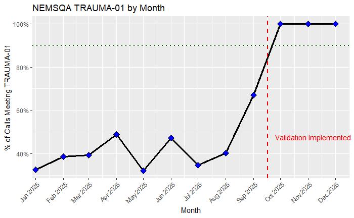

# Case Study: TRAUMA‑01 – Pain Assessment for Trauma Patients  
Dorchester EMS Data Mart – Clinical Measure Implementation (2025)

---

## 1. Overview

This case study describes how the **Dorchester EMS Data Mart** was used to implement and validate the **NEMSQA TRAUMA‑01** measure:

> *Percentage of trauma patients with normal mentation who received a documented pain assessment.*

This document demonstrates:

- How the data mart integrates incidents, situation, vitals, and dispositions  
- How TRAUMA‑01 eligibility is determined  
- How numerator compliance is measured  
- How trend analysis is performed through SQL and R  
- How ETL and data validation support clinical QA/QI  

This case study contains **no PHI** and is safe for sharing with QA/QI partners or other EMS agencies.

---

## 2. Data Sources Used

TRAUMA‑01 requires fields across multiple NEMSIS domains:

### **fact_incident**
- Dispatch → arrival → transport timestamps  
- Transport vs non‑transport disposition  
- Unit and destination lookup keys  

### **fact_situation**
- Primary/secondary impressions  
- Possible injury fields  
- Derived `injury_flag`  

### **dim_disposition**
- Normalized disposition categories:
  - `transport`
  - `transfer`
  - `no_transport`
  - `canceled`
  - `standby`
  - `other`

### **fact_vital** + **dim_vital_type**
Used to detect:
- AVPU
- GCS Total
- Pain Score
- Pain Scale Type

These vitals originate from **wide-format** records in `stage.vitals_stg` and are normalized into **long-format rows** during ETL.

---

## 3. Denominator Definition

A patient encounter is included in the denominator when:

1. **Injury flag is TRUE**, derived from eSituation possible injury fields  
2. **Normal mentation**, defined as:
   - AVPU = "Alert", OR  
   - GCS Total = 15  
3. **Transport or transfer** disposition category  

### SQL Example (Denominator)

```sql
WITH denom AS (
  SELECT DISTINCT i.incident_key
  FROM mart.fact_incident i
  JOIN mart.fact_situation s
    ON s.incident_key = i.incident_key
  JOIN mart.dim_disposition d
    ON i.disposition_key = d.disposition_key
  LEFT JOIN mart.fact_vital v_avpu
    ON v_avpu.incident_key = i.incident_key
  LEFT JOIN mart.dim_vital_type vt_avpu
    ON v_avpu.vital_type_key = vt_avpu.vital_type_key
       AND vt_avpu.vital_type_code = 'AVPU'
  LEFT JOIN mart.fact_vital v_gcs
    ON v_gcs.incident_key = i.incident_key
  LEFT JOIN mart.dim_vital_type vt_gcs
    ON v_gcs.vital_type_key = vt_gcs.vital_type_key
       AND vt_gcs.vital_type_code = 'GCS_TOTAL'
  WHERE s.injury_flag = TRUE
    AND d.category IN ('transport', 'transfer')
    AND (
        (vt_avpu.vital_type_code = 'AVPU' AND v_avpu.vital_value_text = 'Alert')
        OR
        (vt_gcs.vital_type_code = 'GCS_TOTAL' AND v_gcs.vital_value_numeric = 15)
    )
)
SELECT COUNT(*) FROM denom;
```

---

## 4. Numerator Definition

A patient encounter meets the numerator if **any pain assessment** is documented:

- Pain Score vital  
- OR Pain Scale Type vital  

### SQL Example (Numerator)

```sql
WITH denom AS (...),
pain AS (
  SELECT DISTINCT incident_key
  FROM mart.fact_vital v
  JOIN mart.dim_vital_type t
    ON v.vital_type_key = t.vital_type_key
  WHERE t.vital_type_code IN ('PAIN_SCORE', 'PAIN_SCALE_TYPE')
)
SELECT COUNT(*)
FROM denom d
JOIN pain p
  ON d.incident_key = p.incident_key;
```

---

## 5. Monthly Trend Analysis in R

```r
library(DBI)
library(RPostgres)
library(dplyr)
library(lubridate)
library(ggplot2)

con <- dbConnect(
  Postgres(),
  dbname   = Sys.getenv("EMS_MART_DB"),
  host     = Sys.getenv("EMS_MART_HOST"),
  port     = Sys.getenv("EMS_MART_PORT"),
  user     = Sys.getenv("EMS_MART_USER"),
  password = Sys.getenv("EMS_MART_PASSWORD")
)

inc  <- tbl(con, in_schema("mart", "fact_incident"))
sit  <- tbl(con, in_schema("mart", "fact_situation"))
vit  <- tbl(con, in_schema("mart", "fact_vital"))
disp <- tbl(con, in_schema("mart", "dim_disposition"))
vt   <- tbl(con, in_schema("mart", "dim_vital_type"))

# Denominator
den <- inc %>%
  inner_join(sit, by = "incident_key") %>%
  inner_join(disp, by = "disposition_key") %>%
  filter(
    injury_flag == TRUE,
    category %in% c("transport", "transfer")
  ) %>%
  mutate(month = floor_date(psap_time, "month")) %>%
  select(incident_key, month)

# Pain assessment (numerator)
pain <- vit %>%
  inner_join(vt, by = "vital_type_key") %>%
  filter(vital_type_code %in% c("PAIN_SCORE", "PAIN_SCALE_TYPE")) %>%
  distinct(incident_key)

# Join and summarize
monthly <- den %>%
  left_join(pain, by = "incident_key") %>%
  group_by(month) %>%
  summarise(
    denominator = n(),
    numerator   = sum(!is.na(incident_key.y)),
    rate        = numerator / denominator
  ) %>%
  collect()
```

### Visualization

```r
ggplot(monthly, aes(month, rate)) +
  geom_line() +
  geom_point() +
  geom_hline(yintercept = 0.90, linetype = "dotted") +
  labs(
    title = "TRAUMA‑01 Monthly Performance",
    x = "Month",
    y = "Rate (Proportion)"
  ) +
  scale_y_continuous(labels = scales::percent_format()) +
  theme_minimal()
```
### TRAUMA-01 Monthly Performance Chart

<figure>
  
  <figcaption><em>Figure 1.</em> Monthly TRAUMA-01 pain assessment performance for trauma patients with normal mentation.</figcaption>
</figure>

---

## 6. Results Summary (Conceptual)

Your first full-year TRAUMA‑01 evaluation revealed:

- **Significant documentation gaps early in the year**  
- **A dramatic improvement after mid‑September**, coinciding with a new state-level ImageTrend validation rule  
- Post‑validation months approaching **100% compliance**  

This demonstrates:

- The value of system‑level required fields  
- The ability of the Data Mart to detect trends and validate interventions  
- The impact of combining multiple NEMSIS domains through a unified warehouse  

---

## 7. Lessons Learned

### Documentation problems ≠ clinical problems  
Providers documented pain appropriately when prompted consistently.

### A warehouse unlocks cross‑domain analysis  
ImageTrend Report Writer alone cannot join impressions + dispositions + vitals at scale.

### Reproducible analytics matter  
This workflow can be reused for:

- Other trauma measures  
- Cardiac arrest metrics  
- Stroke bundle analytics  
- General QA/QI operational measures  

---

## 8. Future Work

- TRAUMA‑02 (Analgesia administration)  
- PAIN‑01 / PAIN‑02  
- Crew‑level stratification  
- Power BI dashboard development  
- Expansion of `/docs/measures/`  

---

## 9. Document Information

This file contains **no PHI** and may be shared with EMS agencies, QA/QI partners, and internal leadership as part of educational or analytic discussions.

